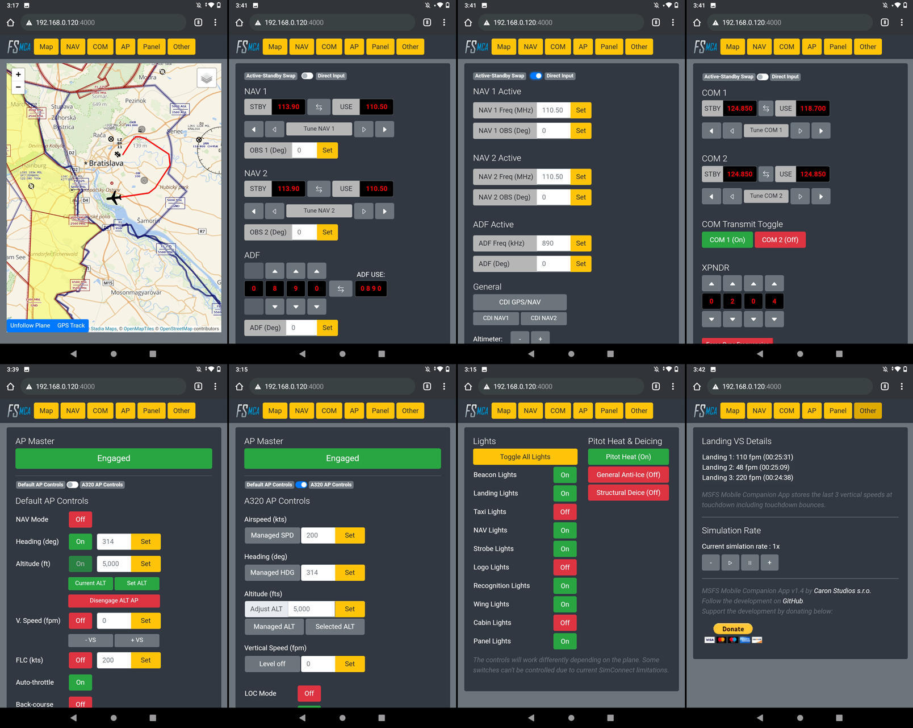

# MSFS Mobile Companion App
MSFS Mobile Companion App is a tool that allows you to control essential aircraft instruments such as NAV/COM frequencies, autopilot or lights using almost any mobile device. The MSFS Mobile Companion App is free to use.

Screenshot of MSFS Mobile Companion App in action:

### MSFS Mobile Companion App features:

- Moving Map (Open Street Maps).
- NAV 1/2 frequency and OBS 1/2 selection.
- ADF frequency and ADF card selection.
- COM 1/2 and transponder selection.
- Autopilot with altitude, vertical speed, and airspeed settings.
- Gyro drift and altimeter pressure settings.
- Light controls.
- Pitot heat and deicing controls.
- Landing ratings (vertical speed at touchdown).
- Simulation rate controls.

## Update Jan/06/2021 Version 1.4 Changelog:

- Dedicated A320 autopilot controls (tested with default A320 and FBW A32NX v0.5.1).
- Various UI fixes, especially for iOS devices.
- UI improvements for color-blind users.

## How do I install MSFS Mobile Companion App?
1. Download the latest build [here](https://github.com/mracko/MSFS-Mobile-Companion-App/releases/).
2. That's it.

## How do I run MSFS Mobile Companion App?
1. Make sure your PC and your mobile device are connected to the same local network and that your home network is set to *Private* in your Network Profile settings. 
2. Start a flight in Microsoft Flight Simulator.
3. Run MSFS_MCA_v1-4.exe that you've unzipped previously.
4. A Microsoft Defender security window may open when launching MSFS_MCA_v1-4.exe for the first time. Allow the "unrecognized app" to run. Additionally, a Windows Security Alert Window may open when you launch MSFS_MCA_v1-4.exe for the first time. Allow private network access for MSFS_MCA_v1-4.exe in the Windows Security Alert Window.
5. A command line window will open that will give you instructions on the IP-address where you can access the MSFS Mobile Companion App. Don't close the command line window.
6. Open the IP-address in your mobile device's web browser. The IP address will most likely be something like *192.168.0.XXX:4000*.

*Notice: You can launch MSFS Mobile Companion App directly from your PC's browser. In that case, just type in localhost:4000 in your browser's url bar.* 

## Known issues:
- Changes to COM frequencies in the A320 will not be shown in the cockpit but will work nevertheless. To force an update of the frequency in the cockpit switch from VHF1 to VHF2 and then back to VHF1 (this is for COM1 frequencies).
- NAV/COM frequencies can get out of sync, especially when rapidly pressing frequency adjustment buttons. Use the "Force Sync Frequencies" button to synchronize frequencies with the sim.
- NAV/COM frequencies are not automatically synchronized when starting a second flight. Use the "Force Sync Frequencies" button to synchronize frequencies with the sim.
- You may see landings with a vertical speed between 0 and 5 fpm in the app. This is caused by the sim recording the plane loading on ground at the start of a flight as a landing.
- Not all deicing and light controls (eg TBM-930) will work with every aircraft. Windshield deicing is currently not supported. This is currently caused by the limitations of SimConnect.
- The app may not work on a fresh Windows 10 installation. You may see a "Could not find MSFS running. Please launch MSFS first and then restart the MSFS 2020 Mobile Companion App." message even if MSFS is running. To fix this, please download and install the Microsoft Visual C++ 2015 Redistributable.

## Credits
MSFS Mobile Companion App is based on the Python [SimConnect](https://pypi.org/project/SimConnect/) project.

## Donation
If you like this tool and would like to support the development, please consider donating by clicking on the link below.

Happy flying!
