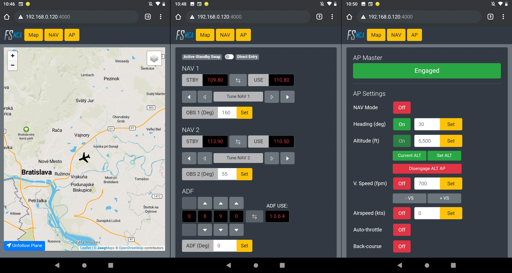

# MSFS Mobile Companion App
MSFS Mobile Companion App is a tool that allows you to control essential aircraft instruments such as NAV frequencies or autopilot using almost any mobile device. The MSFS Mobile Companion App is free to use.

Screenshot of MSFS Mobile Companion App in action:

### MSFS Mobile Companion App features:
- Moving Map (Open Street Maps)
- NAV 1 frequency and OBS 1 selection
- NAV 2 frequency and OBS 2 selection
- ADF frequency and ADF card selection
- Autopilot with altitude, vertical speed, and airspeed settings
- Gyro drift and altimeter pressure settings

## Update 11/11/2020 Version 1.1 Changelog:
- Improved AP functionality. ALT AP can now be used with current or set altitude.
- Added autothrottle toggle.
- Added NAV1/NAV2 source switch for AP and/or CDI.
- Added ADF direct frequency tune option.
- Improved UI for the NAV tab.
- The application doesn't crash when launching before MSFS is running.
- Various other minor bug fixes.

## How do I install MSFS Mobile Companion App?
1. Download the latest build [here](https://github.com/mracko/MSFS-Mobile-Companion-App/releases/tag/v1.1).
2. That's it.

## How do I run MSFS Mobile Companion App?
1. Make sure your PC and your mobile device are connected to the same local network and that your home network is set to *Private* in your Network Profile settings. 
2. Start a flight in Microsoft Flight Simulator.
3. Run MSFS_MCA_v1-1.exe that you've unzipped previously.
4. A Microsoft Defender security window may open when launching MSFS_MCA_v1-1.exe for the first time. Allow the "unrecognized app" to run. Additionally, a Windows Security Alert Window may open when you launch MSFS_MCA_v1-1.exe for the first time. Allow private network access for MSFS_MCA_v1-1.exe in the Windows Security Alert Window.
5. A command line window will open that will give you instructions on the IP-address where you can access the MSFS Mobile Companion App. Don't close the command line window.
6. Open the IP-address in your mobile device's web browser. The IP address will most likely be something like *192.168.0.XXX:4000*.

*Notice: You can launch MSFS Mobile Companion App directly from your PC's browser. In that case, just type in localhost:4000 in your browser's url bar.* 

## Known issues:
- NAV frequencies can get out of sync, especially when rapidly pressing frequency adjustment buttons. Use the "Force Sync Frequencies" button to synchronize frequencies with the sim.
- NAV frequencies are not automatically synchronized when starting a second flight. Use the "Force Sync Frequencies" button to synchronize frequencies with the sim.
- CDI switch doesn't work in 747, A320 and CJ4.
- MSFS Mobile Companion App may crash when accessing it from multiple devices at once.
- May not work on some older devices/browsers (ie iPad 2 has been reported as having issues).

## Credits
MSFS Mobile Companion App is based on the Python [SimConnect](https://pypi.org/project/SimConnect/) project.

## Donation
If you like this tool and would like to support the development, please consider donating by clicking on the link below.

Happy flying!

